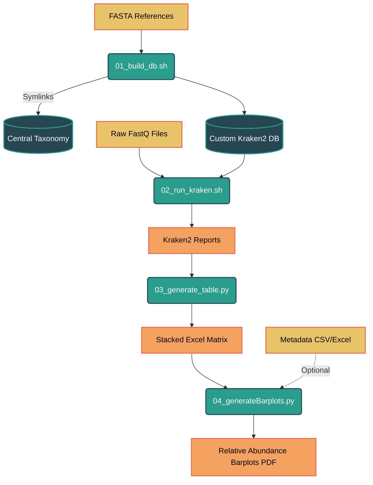
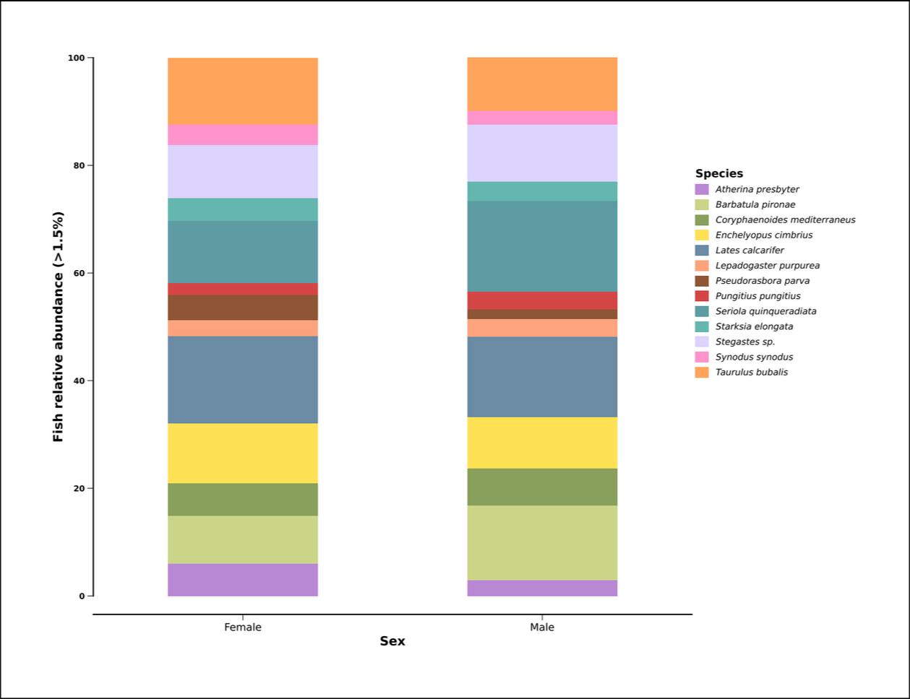

# 🐙 Kraken2 Custom Metagenomics Pipeline

A fully modular, automated pipeline designed to build **multiple Kraken2 custom databases**, run batch metagenomic classification, generate **stacked taxonomic Excel reports**, and produce **publication-ready relative abundance barplots**.

Ideal for projects where you need independent databases (Plants, Insects, Bacteria, Viruses, etc.) without mixing references or wasting disk space.

### 🔥 Key Advantages

| Feature | Description |
| --- | --- |
| **Zero-Duplication Taxonomy** | Only **one central taxonomy folder (~60GB)** is stored — all databases reuse it via **symlinks** |
| **Modular FASTA References** | Each project has its own reference folder (`PLANTS`, `INSECTS`, ...) |
| **Argument-Based Execution** | Every script receives the **DB name as parameter** |
| **Batch Classification** | Automatically processes **all samples** in `raw_fastq/` |
| **Final Excel Matrix** | Consolidates reports into a **single stacked table** |
| **Automated Visualization** | Generates threshold-filtered, stacked relative abundance barplots (PDF), with options for metadata grouping |

---

## 🗺️ Workflow Diagram



---

## 🧠 Architecture Overview

### 1. Modular FASTA Reference System

Each database reads only from its own reference folder:

```text
data/fasta_ref/PLANTS/   → Genomes for PLANTS DB
data/fasta_ref/INSECTS/ → Genomes for INSECTS DB

```

No cross-contamination — perfect for multiple independent projects.

### 2. The "Zero-Duplication" Taxonomy Strategy

Standard Kraken2 DBs store local `taxonomy/` copies (~60GB per DB).

Building 5 DBs = **300GB+ wasted space**.

**Our solution:**

* **📦 Centralized storage**: one `data/taxonomy/` directory shared by all DBs
* **🔗 Symlink-based linking**: each DB folder contains only a link to the master taxonomy
* **💾 <1KB storage per DB**

---

## 🚀 Features

* 🔧 **Custom DB Builder**
* 🧬 Modular **FASTA reference input**
* 🧠 **Central taxonomy with symlink reuse**
* 📊 **Stacked Excel output table**
* 📈 **Automated Barplot Generation** (Individual & Metadata-grouped)
* 🌀 **Batch paired-end processing**
* 🧽 Automatic filename cleaning for sample names

---

## 📂 Repository Structure

```text
kraken_pipeline/
├── data/
│   ├── raw_fastq/             # Paired-end reads: *_1.fastq.gz & *_2.fastq.gz
│   ├── taxonomy/              # MASTER NCBI TAXONOMY (shared via symlinks)
│   ├── fasta_ref/             # Reference genomes grouped by DB name
│   └── dbs/                   # Built Kraken2 databases
│
├── results/
│   ├── reports/               # Kraken2 report outputs
│   └── final_tables/          # Excel summary files
│
├── scripts/
│   ├── 01_build_db.sh         # Builds DB from fasta_ref/<DB_NAME>
│   ├── 02_run_kraken.sh       # Classifies all samples
│   ├── 03_generate_table.py   # Creates stacked Excel taxonomic matrix
│   └── 04_generateBarplots.py # Generates relative abundance PDF barplots
│
├── requirements.txt
├── LICENSE
└── README.md

```

---

## 📖 Usage Guide

### **Phase 1 — Build a Database**

Create reference folder and add any number of `.fasta` genomes:

```bash
mkdir -p data/fasta_ref/PLANTS
cp genomes/*.fasta data/fasta_ref/PLANTS/

```

Build DB:

```bash
cd scripts/
./01_build_db.sh PLANTS

```

### **Phase 2 — Classification**

Place reads inside `data/raw_fastq/`:

```bash
cd scripts/
./02_run_kraken.sh PLANTS

```

> **⚠️ Important Note:** If you run the script without any arguments, it will look for a default database named **`CUSTOM_DB`**.

### **Phase 3 — Reporting**

```bash
cd scripts/
python3 03_generate_table.py PLANTS

```

### **Phase 4 — Visualization (Barplots)**

Generate high-quality, normalized relative abundance barplots (PDF) from your generated tables.

**Example Execution:** Generate a `species`-level barplot grouped by `Sex` with a 1.5% (`0.015`) abundance threshold:

```bash
cd scripts/
python 04_generate_Barplots.py -d ../results/final_tables/Taxonomy_FISH_Cumulative_Reads.xlsx -m "../data/Metadata_Inferred.xlsx" -c Sex -r species -t 0.015 -org Fish
```

#### 📊 Example Output

*(The resulting PDF is exported directly with normalized abundance and square legend markers)*



---

## 🛠 Requirements

```bash
# System
conda install -c bioconda kraken2

# Python
pip install -r requirements.txt

```

---

## 📝 Citation

If you use this pipeline in your research, please cite it as follows:

**APA Format:**

> RoshTzsche. (2026). *Kraken2 Custom Metagenomics Pipeline*. GitHub. [https://github.com/RoshTzsche/kraken_pipeline](https://www.google.com/url?sa=E&source=gmail&q=https://github.com/RoshTzsche/kraken_pipeline)

**BibTeX:**

```bibtex
@software{RoshTzsche_kraken_pipeline_2026,
  author = {RoshTzsche},
  title = {Kraken2 Custom Metagenomics Pipeline},
  year = {2026},
  publisher = {GitHub},
  journal = {GitHub repository},
  howpublished = {\url{https://github.com/RoshTzsche/kraken_pipeline}}
}

```

## 📜 License

MIT — Free for commercial & academic use.
