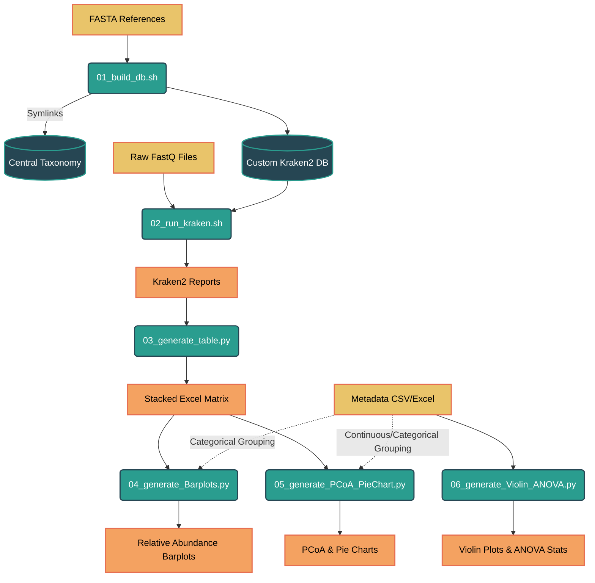
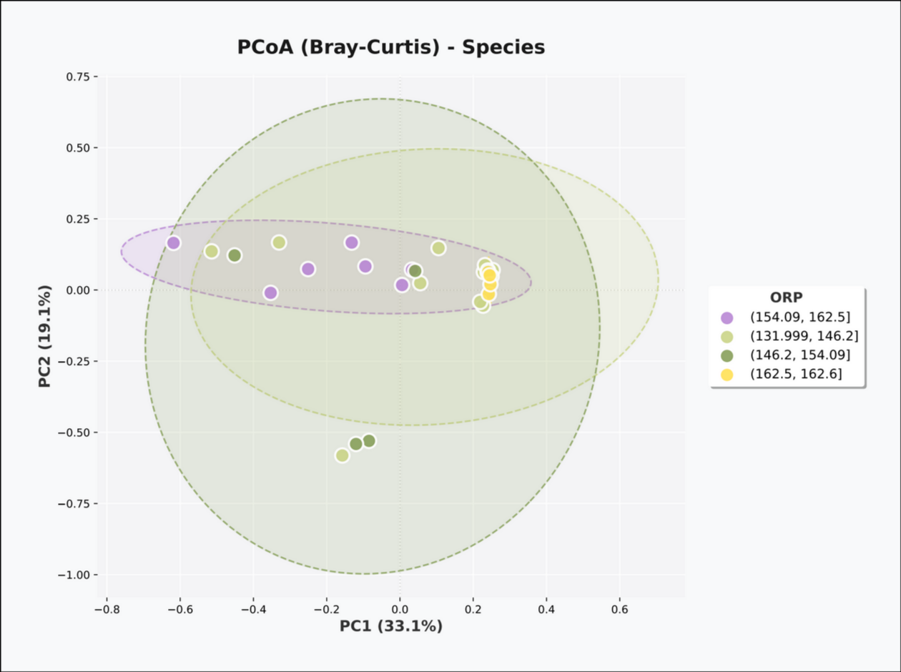
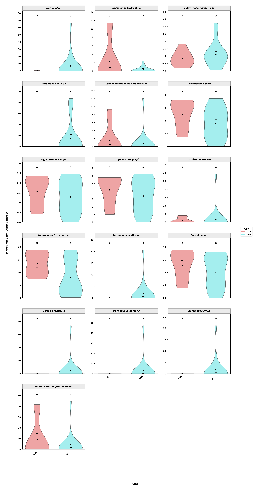

# Kraken2 Custom Metagenomics Pipeline

A modular, automated pipeline engineered to construct multiple isolated Kraken2 custom databases, execute batch metagenomic classification, generate stacked taxonomic matrices, and produce publication-ready statistical visualizations.

This architecture is optimized for environments requiring independent databases (e.g., Plants, Insects, Bacteria, Viruses) without cross-contamination of reference genomes or redundant storage overhead.

---

## Core Capabilities & Statistical Modeling

### Infrastructure & Execution
* **Zero-Duplication Taxonomy Storage:** Utilizes a central taxonomy directory (~60 GB). Isolated databases reference this master directory via symlinks, reducing the storage footprint per database to < 1 KB.
* **Modular FASTA Integration:** Independent reference directories prevent sequence mixing across distinct experimental databases.
* **Batch Processing:** Automated parameter-based execution processes all raw paired-end `*.fastq` samples simultaneously.
* **Matrix Consolidation:** Consolidates raw Kraken2 reports into a unified, stacked taxonomic Excel matrix.

### Downstream Analytics
* **Automated Abundance Filtering:** Implements dynamic thresholding to filter low-abundance taxa, calculating relative abundances dynamically prior to visualization.
* **Bivariate Gaussian Confidence Ellipses:** Automatically computes and visualizes 95% confidence ellipses for Principal Coordinate Analysis (PCoA) groups. For groups where the sample size is $n \ge 3$, the model assumes a bivariate normal distribution to define the spatial bounding of the variance.
* **Continuous Data Binning:** When modeling continuous numerical variables (e.g., pH, ORP) for PCoA grouping, the pipeline automatically executes Quantile Binning. This partitions the gradient into quartiles, yielding four intervals of equal probability mass ($P(X) = 0.25$), ensuring valid geometric ellipse calculation.
* **Parametric Variance Analysis:** Executes One-Way Analysis of Variance (ANOVA) across physicochemical metadata. The pipeline automatically computes the Tukey Honest Significant Difference (HSD) test, generating a Compact Letter Display (CLD) for statistical significance mapping on clinical-grade Violin plots.

---

## Pipeline Architecture



---

## Repository Structure

```text
kraken_pipeline/
├── data/
│   ├── raw_fastq/             # Paired-end reads: *_1.fastq.gz & *_2.fastq.gz
│   ├── taxonomy/              # MASTER NCBI TAXONOMY (shared via symlinks)
│   ├── fasta_ref/             # Reference genomes grouped by DB name
│   └── dbs/                   # Built Kraken2 databases
│
├── results/
│   ├── reports/               # Kraken2 report outputs
│   └── final_tables/          # Excel summary files
│
├── scripts/
│   ├── 01_build_db.sh               # Builds isolated DB from fasta_ref/<DB_NAME>
│   ├── 02_run_kraken.sh             # Batch classifies raw samples
│   ├── 03_generate_table.py         # Consolidates reports into an Excel matrix
│   ├── 04_generate_Barplots.py      # Standardized relative abundance barplots
│   ├── 05_generate_PCoA_PieChart.py # Bray-Curtis PCoA & spatial modeling
│   └── 06_generate_Violin_ANOVA.py  # Parametric significance testing & distributions
│
├── img/                       # Documentation assets
├── requirements.txt
├── LICENSE
└── README.md
```

---

## Execution Guide

### Phase 1: Database Construction
Establish a reference directory corresponding to your project nomenclature and populate it with `.fasta` sequence assemblies.

```bash
mkdir -p data/fasta_ref/PLANTS
cp genomes/*.fasta data/fasta_ref/PLANTS/
cd scripts/
./01_build_db.sh PLANTS
```

### Phase 2: Batch Classification
Transfer paired-end sequence data into the raw input directory and execute classification. *Note: Executing without parameters defaults to targeting a database named `CUSTOM_DB`.*

```bash
cd scripts/
./02_run_kraken.sh PLANTS
```

### Phase 3: Taxonomic Consolidation
Compile individual sequence reports into a global abundance matrix.

```bash
cd scripts/
python3 03_generate_table.py PLANTS
```

---

## Downstream Analytics & Visualization

### Metadata Structuring Requirements
To guarantee a bijective mapping between abundance matrices and phenotypic metadata, structural constraints must be strictly adhered to:
1. **Index Alignment:** The primary identifier column (default: `SampleID`) must strictly match the prefix of the abundance matrix columns (ignoring technical suffixes). E.g., Matrix column `Nlf4_L6_2` maps to metadata ID `Nlf4`.
2. **Categorical Arrays:** String-based columns (e.g., `Treatment`) are grouped by unique topological identities.
3. **Continuous Arrays:** Numerical vectors (e.g., `ORP`, `pH`) must exist as pure scalar magnitudes (float/int). Unit strings (e.g., "mV") will induce vector casting failures.

### 1. Relative Abundance Barplots (`04_generate_Barplots.py`)
Generates normalized, threshold-filtered relative abundance plots. Implements automatic binomial nomenclature italicization for `genus` and `species` ranks. Raster projections (`png`, `tiff`) render at a standard 300 DPI.

**Execution Example:**
```bash
python 04_generate_Barplots.py \
  -d ../results/final_tables/Taxonomy_FISH_Cumulative_Reads.xlsx \
  -m "../data/Metadata_Inferred.xlsx" \
  -c Sex \
  -r species \
  -t 0.015 \
  -org Fish \
  -fmt tiff
```

### 2. PCoA & Spatial Simplex Visualizations (`05_generate_PCoA_PieChart.py`)
Computes the Bray-Curtis dissimilarity matrix $\mathbf{D}$ for principal coordinate dimensionality reduction, or processes global probability simplexes (Pie Charts). 

**Algorithmic Routing (`--mode`):**
* `pcoa`: Solves dissimilarity matrix and confidence ellipses.
* `pie`: Integrates global scalar probability simplex.
* `both`: Executes full analytical suite (Default).

**Execution Example (Isolated PCoA):**
```bash
python 05_generate_PCoA_PieChart.py \
  -d ../results/final_tables/taxonomic_classification_clean.xlsx \
  -r genus \
  -m "../data/Metadata_Inferred.xlsx" \
  -c Sex \
  -id SampleID \
  --mode pcoa \
  -fmt tiff
```

### 3. Parametric Statistical Distributions (`06_generate_Violin_ANOVA.py`)
Executes variance analysis across physicochemical metadata vectors. Generates classic-themed Violin plots overlaying standard error geometries, accompanied by Tukey HSD significance mapping.

**Execution Example (Specific Vectors):**
```bash
python 06_generate_Violin_ANOVA.py \
  -i "../data/Metadata_Cleaned.csv" \
  -c Month \
  -v "DO,pH,Turbidity,ORP" \
  -fmt tiff
```

---

## Example Outputs

### Relative Abundance Barplots


### Principal Coordinate Analysis (PCoA)


### ANOVA & Violin Distributions


---

## Dependencies

```bash
# Core execution dependencies
conda install -c bioconda kraken2

# Python mathematical and visualization libraries
pip install -r requirements.txt
```

---

## Citation & License

**BibTeX:**
```bibtex
@software{RoshTzsche_kraken_pipeline_2026,
  author = {RoshTzsche},
  title = {Kraken2 Custom Metagenomics Pipeline},
  year = {2026},
  publisher = {GitHub},
  journal = {GitHub repository},
  howpublished = {\url{https://github.com/RoshTzsche/kraken_pipeline}}
}
```

**License:** MIT — Unrestricted for commercial and academic utilization.
